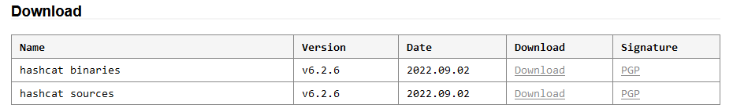
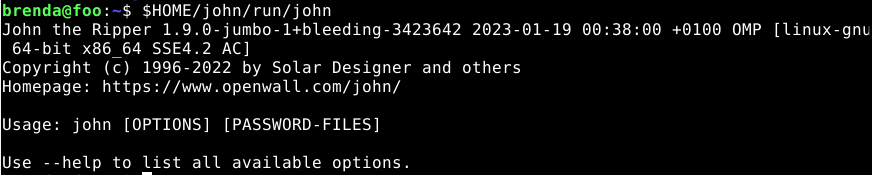
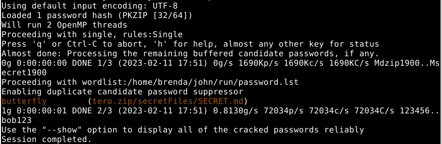
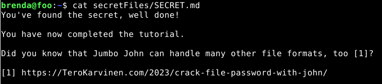
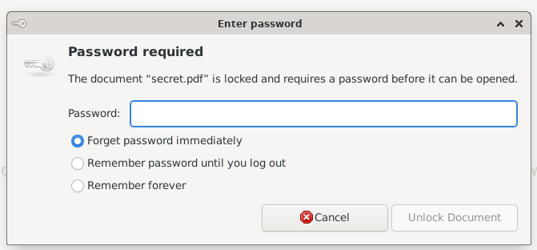
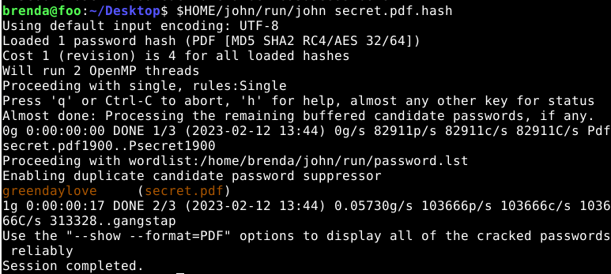

# Table of Contents
- [Schneier 2015: Applied Cryptography](#schneier-2015-applied-cryptography)
- [Hashcat Installation](#hashcat-installation)
- [Hashcat Cracking](#hashcat-cracking)
- [John the Ripper Compilation](#john-the-ripper-compilation)
- [John the Ripper Cracking](#john-the-ripper-cracking)
- [John the Ripper Cracking - Bonus](#john-the-ripper-cracking---bonus)

# Schneier 2015: Applied Cryptography
## Chapter 2.3: One-Way Functions
The particularity of one-way functions is that they are easy to compute in one direction, but very difficult to compute in the other direction. This means that it is easy to compute the hash of a message, but very difficult to compute the message from the hash.
If we want to be strictly mathematical, we have no proof that a one-way function exists. But many functions look like one-way functions.

A trapdoor one-way function is a one-way function that has a trapdoor. This means that it is easy to compute the hash of a message, but very difficult to compute the message from the hash. But, if we have a secret key, we can compute the message from the hash easily.

## Chapter 2.4: One-Way Hash Functions
The one-way hash functions are central to modern cryptography.
A one-way hash function takes a string as input and converts it into a fixed-length string output. The output of the hash function is called the hash value. The hash value is a fixed-length string that is unique for each input string. This means that if we change one character in the input string, the hash value will be completely different. This is why one-way hash functions are used to create hashes.

A good one-way hash function should be collision-free. This means that it should be impossible to find two different strings that have the same hash value.

The hash function is public. The security of a one-way hash function is its one-way property. If a single bit of the input string is changed, the hash value will be completely different.

Usually, one-way hash functions are used to verify the integrity of a message. This means that we can use the hash value to verify that the message has not been changed.

# Hashcat Installation
## Install Hashcat
First, we need to install Hashcat. Hashcat is a password recovery tool that supports a wide variety of hash types. It is available for Windows, Linux, and Mac OS X. We will be using the Linux version for this assignment.
```bash
$ sudo apt-get update
$ sudo apt-get -y install hashid hashcat wget
```
## Create a new directory for the hashcat files
Then, we need to create a new directory for the hashcat files.
```bash
$ mkdir hashed
$ cd hashed
```
## Download a big dictionary file
Next, we need to download a big dictionary file. This file will be used to crack the hashes. For this assignment, we will be using the rockyou.txt file.
```bash
$ wget https://github.com/danielmiessler/SecLists/raw/master/Passwords/Leaked-Databases/rockyou.txt.tar.gz
$ tar xf rockyou.txt.tar.gz
$ rm rockyou.txt.tar.gz
```

# Hashcat Cracking
## Identify the hash type
For this assignment, we need to crack the following hash: 8eb8e307a6d649bc7fb51443a06a216f
First, we need to identify the hash type. We can do this by using the hashid tool.
```bash
$ hashid -m 8eb8e307a6d649bc7fb51443a06a216f
```
The output looks like this:
```bash
Analyzing '8eb8e307a6d649bc7fb51443a06a216f'
[+] MD2 
[+] MD5 [Hashcat Mode: 0]
[+] MD4 [Hashcat Mode: 900]
[+] Double MD5 [Hashcat Mode: 2600]
[+] LM [Hashcat Mode: 3000]
[+] RIPEMD-128 
[+] Haval-128 
[+] Tiger-128 
[+] Skein-256(128) 
[+] Skein-512(128) 
[+] Lotus Notes/Domino 5 [Hashcat Mode: 8600]
[+] Skype [Hashcat Mode: 23]
[+] Snefru-128 
[+] NTLM [Hashcat Mode: 1000]
[+] Domain Cached Credentials [Hashcat Mode: 1100]
[+] Domain Cached Credentials 2 [Hashcat Mode: 2100]
[+] DNSSEC(NSEC3) [Hashcat Mode: 8300]
[+] RAdmin v2.x [Hashcat Mode: 9900]
```
This output tells us that the hash is an MD5 hash. The hashcat mode for MD5 is 0.

## Crack the hash
Now that we know the hash type, we can crack the hash. We can do this by using the hashcat tool.
```bash
$ hashcat -m 0 '8eb8e307a6d649bc7fb51443a06a216f' rockyou.txt -o solved
```
But, unfortunately, this command does not work in my case. I get the following error:
```bash
Watchdog: Hardware monitoring interface not found on your system.
Watchdog: Temperature abort trigger disabled.

Initializing backend runtime for device #1...Illegal instruction
```
I tried to fix the problem, but it seems that this error means that there's a byte in the assembled file which doesn't represent a valid CPU instruction.

So I decided to install Hashcat on my host Windows machine. I downloaded the latest version of Hashcat from the official website: https://hashcat.net/hashcat/
I choose the hashcat binaries:



I extracted the archive and ran hashcat with the command prompt:
```cmd
$ cd C:\hashcat-6.2.6
$ hashcat.exe -b
```
Now, I have to download the rockyou.txt file in my Windows machine. I put the file in the same directory as hashcat.exe.

Then, I just run the same command as before:
```cmd
$ hashcat -m 0 8eb8e307a6d649bc7fb51443a06a216f rockyou.txt --show
```
The two differences are that I had to revome the quotes around the hash and I also added the --show option instead of the -o option. The --show option will show the cracked password in the command prompt.
```cmd
8eb8e307a6d649bc7fb51443a06a216f:february
```
The password is february.

# John the Ripper Compilation
For this part, I was able to do it on my virtual machine.

## Install prerequisites
First, we need to install the prerequisites for John the Ripper. We can do this by using the following commands:
```bash
$ sudo apt-get update
$ sudo apt-get -y install micro bash-completion git build-essential libssl-dev zlib1g zlib1g-dev zlib-gst libbz2-1.0 libbz2-dev atool zip wget
```
For more information about the prerequisites, see: https://terokarvinen.com/2023/crack-file-password-with-john/

## Download and Compile John the Ripper
Next, we need to download and compile John the Ripper. We can do this by using the following commands:
```bash
$ git clone --depth=1 https://github.com/openwall/john.git
$ cd john/src/	
$ ./configure
$ make -s clean && make -sj4
```
For more information about the compilation, see: https://terokarvinen.com/2023/crack-file-password-with-john/

Once the compilation is done, we can find the new executables in run/.
```bash
$ cd ../run/
$ ls -1
1password2john.py
7z2john.pl
DPAPImk2john.py
adxcsouf2john.py
aem2john.py
...
$ cd
```
To run it, we can use the following command:
```bash
$ $HOME/john/run/john
```



# John the Ripper Cracking
First, we need to download the file that we want to crack. For this assignment, we will be using the file "tero.zip".
```bash
$ wget https://TeroKarvinen.com/2023/crack-file-password-with-john/tero.zip
```
Then, we will try to unzip the file.
```bash
$ unzip tero.zip
```
But, unfortunately, we need a password to unzip the file. So, we need to crack the password.

## Crack ZIP password
This is a two-step process. First, we need to extract the hash from the file into a file called tero.zip.hash.
```bash
$ $HOME/john/run/zip2john tero.zip >tero.zip.hash
```
To have a look at the hash, we can use the following command:
```bash
$ cat tero.zip.hash
```
The output looks like this:
```bash
tero.zip/secretFiles/SECRET.md:$pkzip$1*1*2*0*b7*d9*4c752c85*46*4f*8*b7*572b*6fc2fc774ed6b264ebea4c64b1b1ae935507abd1ca544987e878fcad58bb132bc60240152c250dbfcc07b47b348b7ac4f2ae938cceeca978e258b0f1bd2fc7096ad24760a9e20353c75c6588413da66e98dc620e6d9e7f3abc73fd5a12ce1c205072efa1f55bf8d6a06ed7e7998ad0a921d4a3dd8b7bfb3fbc96c2fce5640a87554bb002ab5e6153ca10850ee79bdfa5c85ce4e6b446f972735c5385f3239e182e2c4e59214eb03a6aee636631fec207d9d3eb7560c83d*$/pkzip$:secretFiles/SECRET.md:tero.zip::tero.zip
```
Then, we will perform the actual cracking against the hash.
```bash
$ $HOME/john/run/john tero.zip.hash
```
The output looks like this:
```bash
Using default input encoding: UTF-8
Loaded 1 password hash (PKZIP [32/64])
Will run 2 OpenMP threads
Proceeding with single, rules:Single
Press 'q' or Ctrl-C to abort, 'h' for help, almost any other key for status
Almost done: Processing the remaining buffered candidate passwords, if any.
0g 0:00:00:00 DONE 1/3 (2023-02-11 17:51) 0g/s 1690Kp/s 1690Kc/s 1690KC/s Mdzip1900..Msecret1900
Proceeding with wordlist:/home/brenda/john/run/password.lst
Enabling duplicate candidate password suppressor
butterfly        (tero.zip/secretFiles/SECRET.md)     
1g 0:00:00:01 DONE 2/3 (2023-02-11 17:51) 0.8130g/s 72034p/s 72034c/s 72034C/s 123456..bob123
Use the "--show" option to display all of the cracked passwords reliably
Session completed.
```
We can see in the screenshot below that the password is highlighted in brown. The password is "butterfly".



## Extract ZIP file
Now that we have the password, we can extract the file.
```bash
$ unzip tero.zip
```
The output looks like this:
```bash
Archive:  tero.zip
[tero.zip] secretFiles/SECRET.md password: 
  inflating: secretFiles/SECRET.md
```
Then, we can have a look at the file.
```bash
$ cat secretFiles/SECRET.md
```



# John the Ripper Cracking - Bonus

## Create a protected file
First, we need to create a file that we want to protect. I chose a PDF format.
I started by creating a word file on my Windows host machine.
Then, I saved it as a PDF file, and I protected it with a password (I used Microsoft Word to do this).
Because I had installed the VirtualBox tools beforehand and I enabled bidirectional Drag'n'Drop, I was able to drag and drop the file from my desktop on my host machine directly to my virtual machine.

Now, if I try to open the file, I will be prompted for a password.
```bash
$ xdg-open secret.pdf
```



## Crack PDF password
This is also a two-step process. First, we need to extract the hash from the file into a file called secret.pdf.hash.
First, I wanted to see if there was a PDF2John tool, so I ran the following command:
```bash
$ cd $HOME/john/run/
$ ls -1
```
I found the following tool:
```bash
pdf2john.pl
```
So, I ran the following command:
```bash
$ $HOME/john/run/pdf2john.pl secret.pdf >secret.pdf.hash
```
We can have a look at the hash:
```bash
$ cat secret.pdf.hash
```
The output looks like this:
```bash
secret.pdf:$pdf$4*4*128*-1060*1*16*f5ca0c25d1574345826333c3c0738017*32*1850131d88fe337bf7b8060940725cfd00000000000000000000000000000000*32*390b5f0d0202cb3145cbb7c709c1fa2d0d1eac74dfc7afbc74ba3d3e8d92b676
```
Then, we will perform the actual cracking against the hash.
```bash
$ $HOME/john/run/john secret.pdf.hash
```
This is the output:



We can see in the screenshot above that the password is highlighted in brown. The password is "greendaylove".

## Open PDF file
Now that we have the password, we can open the file.
```bash
$ xdg-open secret.pdf
```


## Formats supported by John the Ripper
To see the list of formats supported by John the Ripper, we can run the following command:
```bash
$ $HOME/john/run/john --list=formats
```
This is the list of formats:
```bash
descrypt, bsdicrypt, md5crypt, md5crypt-long, bcrypt, scrypt, LM, AFS, 
tripcode, AndroidBackup, adxcrypt, agilekeychain, aix-ssha1, aix-ssha256, 
aix-ssha512, andOTP, ansible, argon2, as400-des, as400-ssha1, asa-md5, 
AxCrypt, AzureAD, BestCrypt, BestCryptVE4, bfegg, Bitcoin, BitLocker, 
bitshares, Bitwarden, BKS, Blackberry-ES10, WoWSRP, Blockchain, cardano, 
chap, Clipperz, cloudkeychain, dynamic_n, cq, CRC32, cryptoSafe, sha1crypt, 
sha256crypt, sha512crypt, Citrix_NS10, dahua, dashlane, diskcryptor, Django, 
django-scrypt, dmd5, dmg, dominosec, dominosec8, DPAPImk, dragonfly3-32, 
dragonfly3-64, dragonfly4-32, dragonfly4-64, Drupal7, eCryptfs, eigrp, 
electrum, ENCDataVault-MD5, ENCDataVault-PBKDF2, EncFS, enpass, EPI, 
EPiServer, ethereum, fde, Fortigate256, Fortigate, FormSpring, FVDE, geli, 
gost, gpg, HAVAL-128-4, HAVAL-256-3, hdaa, hMailServer, hsrp, IKE, ipb2, 
itunes-backup, iwork, KeePass, keychain, keyring, keystore, known_hosts, 
krb4, krb5, krb5asrep, krb5pa-sha1, krb5tgs, krb5-17, krb5-18, krb5-3, 
kwallet, lp, lpcli, leet, lotus5, lotus85, LUKS, MD2, mdc2, MediaWiki, 
monero, money, MongoDB, scram, Mozilla, mscash, mscash2, MSCHAPv2, 
mschapv2-naive, krb5pa-md5, mssql, mssql05, mssql12, multibit, mysqlna, 
mysql-sha1, mysql, net-ah, nethalflm, netlm, netlmv2, net-md5, netntlmv2, 
netntlm, netntlm-naive, net-sha1, nk, notes, md5ns, nsec3, NT, NT-long, 
o10glogon, o3logon, o5logon, ODF, Office, oldoffice, OpenBSD-SoftRAID, 
openssl-enc, oracle, oracle11, Oracle12C, osc, ospf, Padlock, Palshop, 
Panama, PBKDF2-HMAC-MD4, PBKDF2-HMAC-MD5, PBKDF2-HMAC-SHA1, 
PBKDF2-HMAC-SHA256, PBKDF2-HMAC-SHA512, PDF, PEM, pfx, pgpdisk, pgpsda, 
pgpwde, phpass, PHPS, PHPS2, pix-md5, PKZIP, po, postgres, PST, PuTTY, 
pwsafe, qnx, RACF, RACF-KDFAES, radius, RAdmin, RAKP, rar, RAR5, Raw-SHA512, 
Raw-Blake2, Raw-Keccak, Raw-Keccak-256, Raw-MD4, Raw-MD5, Raw-MD5u, Raw-SHA1, 
Raw-SHA1-AxCrypt, Raw-SHA1-Linkedin, Raw-SHA224, Raw-SHA256, Raw-SHA3, 
Raw-SHA384, restic, ripemd-128, ripemd-160, rsvp, RVARY, Siemens-S7, 
Salted-SHA1, SSHA512, sapb, sapg, saph, sappse, securezip, 7z, Signal, SIP, 
skein-256, skein-512, skey, SL3, Snefru-128, Snefru-256, LastPass, SNMP, 
solarwinds, SSH, sspr, Stribog-256, Stribog-512, STRIP, SunMD5, SybaseASE, 
Sybase-PROP, tacacs-plus, tcp-md5, telegram, tezos, Tiger, tc_aes_xts, 
tc_ripemd160, tc_ripemd160boot, tc_sha512, tc_whirlpool, vdi, OpenVMS, vmx, 
VNC, vtp, wbb3, whirlpool, whirlpool0, whirlpool1, wpapsk, wpapsk-pmk, 
xmpp-scram, xsha, xsha512, zed, ZIP, ZipMonster, plaintext, has-160, 
HMAC-MD5, HMAC-SHA1, HMAC-SHA224, HMAC-SHA256, HMAC-SHA384, HMAC-SHA512, 
dummy, crypt
420 formats (149 dynamic formats shown as just "dynamic_n" here)
```